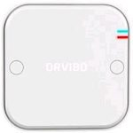

*To contribute to this page, edit the following
[file](https://github.com/Koenkk/zigbee2mqtt.io/blob/master/docs/devices/T18W3Z.md)*

# ORVIBO T18W3Z

| Model | T18W3Z  |
| Vendor  | ORVIBO  |
| Description | Neutral smart switch 3 gang |
| Supports | on/off |
| Picture |  |

## Notes

None

## Manual Home Assistant configuration
Although Home Assistant integration through [MQTT discovery](../integration/home_assistant) is preferred,
manual integration is possible with the following configuration:



```yaml
switch:
  - platform: "mqtt"
    state_topic: "zigbee2mqtt/<FRIENDLY_NAME>"
    availability_topic: "zigbee2mqtt/bridge/state"
    payload_off: "OFF"
    payload_on: "ON"
    value_template: "{{ value_json.state_l1 }}"
    command_topic: "zigbee2mqtt/<FRIENDLY_NAME>/l1/set"

switch:
  - platform: "mqtt"
    state_topic: "zigbee2mqtt/<FRIENDLY_NAME>"
    availability_topic: "zigbee2mqtt/bridge/state"
    payload_off: "OFF"
    payload_on: "ON"
    value_template: "{{ value_json.state_l2 }}"
    command_topic: "zigbee2mqtt/<FRIENDLY_NAME>/l2/set"

switch:
  - platform: "mqtt"
    state_topic: "zigbee2mqtt/<FRIENDLY_NAME>"
    availability_topic: "zigbee2mqtt/bridge/state"
    payload_off: "OFF"
    payload_on: "ON"
    value_template: "{{ value_json.state_l3 }}"
    command_topic: "zigbee2mqtt/<FRIENDLY_NAME>/l3/set"

sensor:
  - platform: "mqtt"
    state_topic: "zigbee2mqtt/<FRIENDLY_NAME>"
    availability_topic: "zigbee2mqtt/bridge/state"
    icon: "mdi:signal"
    unit_of_measurement: "lqi"
    value_template: "{{ value_json.linkquality }}"
```



